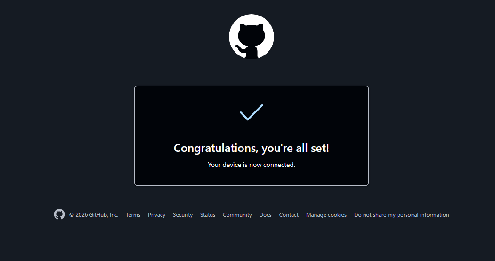

# Image #1 — GitHub device-auth success screen

**Scene:** Browser confirmation after completing GitHub CLI device login during the GitJuked first-deploy workflow.



**Visual numbered callouts:** [deploy-auth-visual.html](deploy-auth-visual.html) — pins 1–6 overlaid on the screenshot.

---

## What you are looking at

GitHub’s dark-theme **device login success** page. It appears at `https://github.com/login/device` after you enter the one-time code shown in PowerShell. This screen means `gh` on your machine is now authorized to act as your GitHub account — the prerequisite for creating the repo, pushing `main`, and enabling Pages.

---

## Region callouts

| # | Region | What it is | Meaning in GitJuked deploy |
|---|--------|------------|----------------------------|
| 1 | **GitHub logo** (top center, white circle + Octocat) | Brand anchor | Confirms you are on the official GitHub device-login flow — not a phishing page. |
| 2 | **Success card** (center, rounded rectangle, thin border) | Confirmation container | Frames the auth result; no further input needed on this page. |
| 3 | **Blue checkmark** (✓, top of card) | Success indicator | Device pairing succeeded; GitHub accepted your one-time code. |
| 4 | **Headline** — *“Congratulations, you're all set!”* | Primary message | Auth is complete. Safe to close this tab and return to PowerShell. |
| 5 | **Subtext** — *“Your device is now connected.”* | Secondary message | GitHub CLI on your machine is linked to account `cxmx-dev`. |
| 6 | **Footer** (© 2026 GitHub, Inc. + Terms / Privacy / … links) | Standard GitHub chrome | Unrelated to deploy; ignore for workflow purposes. |

---

## Paired PowerShell output

This screenshot corresponds to running `.\scripts\auth-github.ps1` from the repo root:

```text
? Authenticate Git with your GitHub credentials? Yes

! First copy your one-time code: XXXX-XXXX
Press Enter to open https://github.com/login/device in your browser...
✓ Authentication complete.
- gh config set -h github.com git_protocol https
✓ Configured git protocol
✓ Logged in as cxmx-dev
```

| Terminal line | Ties to image |
|---------------|---------------|
| `XXXX-XXXX` | One-time code you paste on the device-login page **before** this success screen appears. |
| `Press Enter to open https://github.com/login/device` | Opens the browser tab that ends on Image #1. |
| `✓ Authentication complete.` | Browser and CLI are in sync — same moment as the checkmark screen. |
| `✓ Logged in as cxmx-dev` | Account that will own `cxmx-dev/GitJuked` and Pages. |

---

## What to run next

Auth is done when you see Image #1 **and** `Logged in as cxmx-dev` in the terminal. Immediately run:

```powershell
cd GitJuked
.\scripts\push-pages.ps1
```

That script:

1. Creates public repo `cxmx-dev/GitJuked` (if missing)
2. Pushes `main` (player + `audio/` + `tracks.json`)
3. Enables GitHub Pages from repo root

**Live URL** (after ~1–3 min build): **https://cxmx-dev.github.io/GitJuked/**

---

## Full first-deploy sequence (auth → push → live)

```powershell
cd GitJuked
.\scripts\auth-github.ps1    # → Image #1 + "Logged in as cxmx-dev"
.\scripts\push-pages.ps1     # → repo + Pages live
```

Verify: open https://cxmx-dev.github.io/GitJuked/ — cyber-green HUD, visualizer, seed tracks from `tracks.json`.

---

## Troubleshooting

| Symptom | Fix |
|---------|-----|
| `gh` not recognized | `winget install GitHub.cli` or use `.\scripts\auth-github.ps1` (full path wrapper) |
| Browser shows 404 on Pages URL | Wait 1–3 min after `push-pages.ps1`; confirm Pages status in repo **Settings → Pages** |
| `Not logged in` from `push-pages.ps1` | Re-run `.\scripts\auth-github.ps1` until Image #1 appears |
| Want player public but repo hidden | [docs/repo-privacy.md](repo-privacy.md) — requires GitHub Pro; Free + private repo breaks Pages |